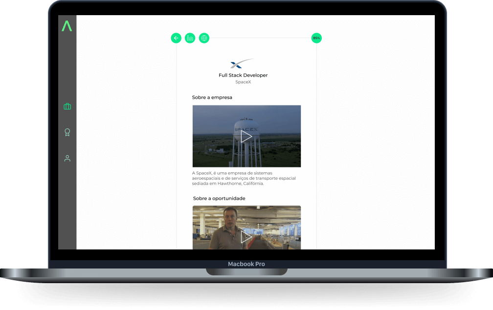

<h1 align="center">
  
</h1>
<p align="center">
  <a href="#-sobre-o-projeto">Sobre o projeto</a>&nbsp;&nbsp;&nbsp;|&nbsp;&nbsp;&nbsp;
  <a href="#-tecnologias">Tecnologias</a>&nbsp;&nbsp;&nbsp;|&nbsp;&nbsp;&nbsp;
  <a href="#-como-utilizar">Desenvolvimento</a>&nbsp;&nbsp;&nbsp;|&nbsp;&nbsp;&nbsp;
  <a href="#-como-contribuir">Como contribuir</a>&nbsp;&nbsp;&nbsp;|&nbsp;&nbsp;&nbsp;
  <a href="#-licença">Licença</a>
</p>
<div align="center">
    <p>
***    </p>
</div>

</br>
</br>

<p align="center">
  
</p>

</br>
</br>


# 💡 Sobre o projeto
O Elevator é uma plataforma de recrutamento para profissionais de tecnologia (Desenvolvedores e Designers). Utilizamos um pitch de 1 min como principal meio do candidato se apresentar para vaga, essa abordagem permite agilizar o recrutamento, e ao mesmo tempo, o recrutador consegue avaliar algumas softskills antes mesmo da entrevista.

🚧 **Em desenvolvimento** 🚧

[**Link para API**](https://github.com/ViniciusMazon/elevator-api)


</br>
</br>

<p align="center">
  
</p>

</br>
</br>

# 🔬 Tecnologias

* [NodeJs](https://nodejs.org/en/)
* [TypeScriot](https://www.typescriptlang.org)
* [ReactJs](https://reactjs.org)
* [Squelize ORM](https://sequelize.org)
* [Docker](https://www.docker.com)
* [Postgres](https://www.postgresql.org)
* [JWT](https://jwt.io)

# ⚙️ Desenvolvimento

Clone o repositório:

```bash
git clone https://github.com/ViniciusMazon/elevator-web.git
```

Instale as dependência rodando, individualmente em cada diretório (api, web e mobile), o comando:

```
yarn
```

Rode o projeto utilizando o script:

```
yarn start
```


# 🖖🏻 Como contribuir

- Faça um fork desse repositório;
- Clone esse repositório em sua máquina: `https://github.com/ViniciusMazon/elevator-web.git`
- Cria uma branch com a sua feature: `git checkout -b minha-feature`;
- Faça commit das suas alterações: `git commit -m 'feat: Minha nova feature'`;
- Faça push para a sua branch: `git push origin minha-feature`.

Depois que o merge da sua pull request for feito, você pode deletar a sua branch.

# 📃 Licença

Esse projeto está sob a licença MIT. Veja o arquivo LICENSE para mais detalhes.

Feito com 🖤 por Vinicius Mazon.

